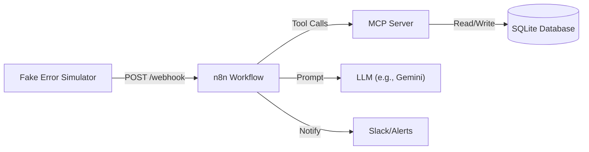

# DevOps Incident Agent

An AI-powered automated incident response system that monitors logs, identifies know errors, and assists with root cause analysis using Large Language Models (LLMs).

## 🚀 Overview

The **DevOps Incident Agent** is designed to streamline the incident management lifecycle. It sits between your application logs and your alert channels, automatically fingerprinting errors to identify recurrences and using AI to suggest fixes for new issues.

The system consists of three main components:

1.  **Fake Error Simulator**: Generates realistic application traffic and chaos events (errors) for testing.
2.  **MCP Server**: A Model Context Protocol (MCP) server that provides the "brain" – a set of tools for log analysis, database persistence (SQLite), and knowledge base management.
3.  **n8n Workflow**: The orchestration layer that connects the simulator's webhooks to the MCP server and external services (like Slack/LLMs).

## 🏗️ Architecture



## ✨ Key Features

- **Automated Log Analysis**: Normalizes raw error logs and generates unique fingerprints for deduplication.
- **Knowledge Base**: Automatically builds a database of "Known Errors" with suggested fixes.
- **Incident Recording**: detailed logging of every incident with metadata.
- **AI Integration**: Uses LLMs to analyze stack traces and suggest fixes for unknown errors.

## 🛠️ Prerequisites

- **Python 3.10+**
- **n8n**: Desktop or Cloud version.
- **uv**: An extremely fast Python package installer and resolver.

## 📦 Installation & Setup

### 1. Clone the Repository

```bash
git clone https://github.com/Aymen-BSL/devops-incident-agent.git
cd devops-incident-agent
```

### 2. Fake Error Simulator

This component simulates a microservices environment generating traffic and occasional errors.

**Dependencies:**

- `faker`

**Setup:**

```bash
cd fake_error_simulator
uv sync
# OR
pip install faker
```

### 3. MCP Server

This is the core agent enabling n8n to interact with the database and analysis tools.

**Dependencies:**

- `fastmcp`
- `python-dotenv` (optional but recommended for env vars)

**Setup:**

```bash
cd mcp_server
uv sync
# OR
pip install fastmcp python-dotenv
```

## 🚀 Usage

### Step 1: Start the MCP Server

Run the MCP server to expose the tools.

```bash
# In mcp_server/
uv run main.py
```

_The server typically runs on port 8000._

### Step 2: Configure n8n

1.  Import the workflow file (if available in the repo) or create a workflow that triggers on a Webhook.
2.  Connect the MCP Client node in n8n to your local MCP server.

### Step 3: Start the Simulator

Run the simulator to start sending data to your n8n webhook.

```bash
# In fake_error_simulator/
uv run main.py
```

_The simulator will send a request every ~30 seconds._

## 🤝 Contributing

Contributions are welcome! Please fork the repository and submit a pull request for any enhancements.

---

_Created with ❤️ by Antigravity_
